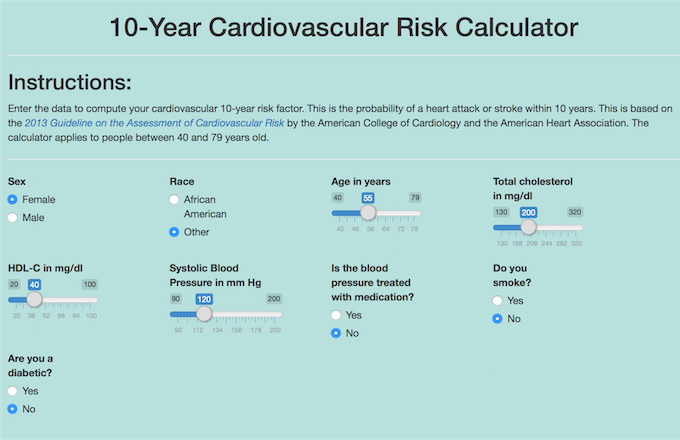

```{r setup, include=FALSE}
knitr::opts_chunk$set(echo = FALSE)
```

## Motivation

* Cardiovascular disease remains the single largest killer in the developed world
* Tools to compute the risk of cardiovascular events help:
    + Physicians risk stratify and manage patients.
    + Educate patients about their risk and what they can do about it.
* A web based calculator of such risk is a most useful tool.
    + This is calculator prototyped using shiny is my project.

---

## Source

* The equation for the calculator is described in the [2013 Guideline on the Assesment of Cardiovascular Risk](http://bit.ly/1Os6cgR) by the American College of Cardiology and the American Heart Association.
* The guidelines also provide extensive details on its justification and how to apply the tool.
* It meets the needs of working healthcare professionals and patients who wish to understand their risk of cardiovascular disease.

---

## Example Input and Output



```{r echo = FALSE}
source("./src/cvcalc.R")
print(paste0("10-year cardiovascular risk: ",round(cvcalc("Female","Other",pack.obs(55,200,40,0,120,0,0)),1),"%"))
```

---

## Shiny Implementation

* Shiny allows for a fast implementation of the calculator using R as an engine.
* The speed allows for creation of multiple prototypes.
* The widgets allow for clean input of the necessary parameters such as age and sex.
    + The user interface follows common browser standards so instructions are nearly unnecessary.
* This is illustrated in WEBSITE
* An example of an end-product using javascript is available at [www.cvriskcalculator.com](www.cvriskcalculator.com/)

Slides hosted in [github](https://github.com/gamercier/cvCalculator_slides/tree/gh-pages)
